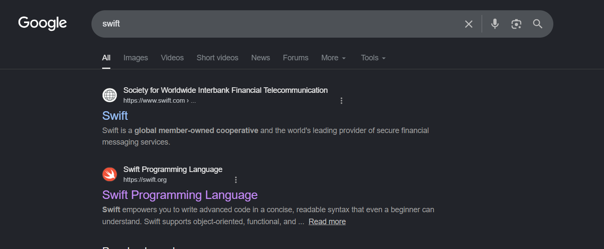

# How to Install SWIFT ?

Search "swift"

<figure><figcaption></figcaption></figure>

Click  [swift.org](https://swift.org)

Click Install

<figure><figcaption></figcaption></figure>

Click on Windows

<figure><figcaption></figcaption></figure>

Open Terminal and Run these Commands


```powershell
winget install --id Microsoft.VisualStudio.2022.Community --exact --force --custom "--add Microsoft.VisualStudio.Component.Windows11SDK.22621 --add Microsoft.VisualStudio.Component.VC.Tools.x86.x64 --add Microsoft.VisualStudio.Component.VC.Tools.ARM64" --source winget
```



```powershell
winget install --id Swift.Toolchain -e --source winget
```



To CHECK WHETHER IT INSTALLED OR NOT


```
swift --version
```



### HOW TO SETUP A PROJECT

Create a folder "SWIFT" on desktop

|

Open that folder in vs code

|

Open terminal and run:


```powershell
swift package init --name MyCLI --type executable
```


|

Run it


```swift
swift run
```



### SOURCES:

[https://www.swift.org/install/windows/](https://www.swift.org/install/windows/)
